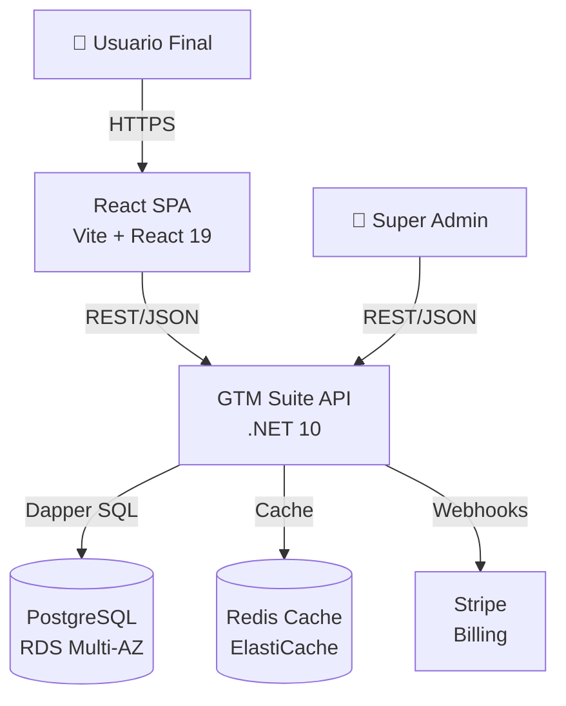

# 12 · C4 Model — Diagramas de arquitectura por niveles

Comunicar la arquitectura de un sistema es difícil: un diagrama de clases es demasiado detallado para un manager de producto, y un diagrama de alto nivel deja a los ingenieros sin suficiente contexto. El C4 model resuelve esto con cuatro niveles de granularidad, cada uno diseñado para una audiencia distinta, que permiten describir un sistema desde su contexto de negocio hasta el código, usando solo texto como fuente de verdad.

> Fuente: *Enterprise Architecture with .NET* (Colinet) — Ch.7 C4 and Other Approaches; c4model.com (Simon Brown)

---

## Los cuatro niveles

```
Nivel 1: Context    → ¿Qué hace el sistema y quién lo usa?          (para todos)
Nivel 2: Container  → ¿Qué procesos / apps / DBs componen el sistema? (para dev líderes)
Nivel 3: Component  → ¿Qué módulos hay dentro de cada container?     (para devs)
Nivel 4: Code       → ¿Cómo están organizadas las clases?            (solo si agrega valor)
```

Cada nivel detalla el interior de una caja del nivel anterior. Las dependencias entre niveles siempre apuntan hacia adentro (igual que en Clean Architecture).

---

## Nivel 1 — Context

Muestra el sistema como una caja negra: solo sus actores externos (usuarios, sistemas externos) y cómo interactúan con él. No se muestran tecnologías ni detalles internos.

```
[Usuario Final]  →  [GTM Suite (SaaS)]  →  [SendGrid (emails)]
[Super Admin]    →  [GTM Suite (SaaS)]  →  [Stripe (billing)]
                                        →  [AWS S3 (archivos)]
                                        →  [Keycloak/OIDC (auth)]
```

**Audiencia:** stakeholders de negocio, product managers, cualquier persona fuera del equipo técnico.

**Regla:** sin tecnologías. Solo personas, sistemas y relaciones.

---

## Nivel 2 — Container

Abre la caja del sistema y muestra sus unidades de despliegue independientes: aplicaciones web, APIs, bases de datos, colas, jobs.

```
[Cliente React SPA]
        |  HTTPS API calls
        ↓
[GTM Suite API (.NET 10 / ASP.NET Core)]  ←→  [PostgreSQL (RDS)]
        |                                  ←→  [Redis Cache]
        |  Publica eventos
        ↓
[RabbitMQ / SQS]
        |
        ↓
[Worker Service (background jobs / Hangfire)]
```

**Audiencia:** desarrolladores senior, arquitectos, DevOps.

**Regla:** mostrar tecnología, protocolo de comunicación (HTTPS, AMQP, TCP) y base de datos.

---

## Nivel 3 — Component

Abre uno de los containers y muestra sus módulos internos (en .NET: proyectos, assemblies, capas de Clean Architecture).

```
GTM Suite API — componentes internos:

[WebApi Layer]          → Controllers, Presenters, ViewModels
     ↓ Mediator.Send()
[Application Layer]     → Handlers, Pipeline Behaviors, DTOs, Requests/Responses
     ↓ IRepository
[Domain Layer]          → Entities, Domain Interfaces
     ↑ Implementa
[Infrastructure Layer]  → Repositorios (Dapper), EF Core Configs, SQL classes
     ↓ Conexión
[PostgreSQL / Redis]
```

**Audiencia:** desarrolladores del equipo.

**Regla:** mostrar dependencias entre módulos, patrones usados (Repository, CQRS, etc.).

---

## Nivel 4 — Code

Diagrama de clases o de secuencia para documentar algo complejo o no obvio. **Solo usarlo cuando el texto no es suficiente.**

```
Flujo de un request de GetExampleUser:

ExampleUsersController
    → IMediator.Send(GetExampleUserRequest)
        → [ValidationBehavior]
        → [LoggingBehavior]
        → GetExampleUserHandler
            → IExampleUserRepository.GetByPublicIdAsync()
                → ExampleUserRepository (Dapper)
                    → PostgreSQL
            ← ExampleUser (entity)
        ← GetExampleUserSuccess(ExampleUserDto)
    → IMediator.Publish(GetExampleUserSuccess)
        → GetExampleUserPresenter
            → _viewModel = Results.Ok(dto)
    ← _viewModel.IsSuccess ? Ok(...) : NotFound(...)
```

**Regla:** No diagramar todo el código. Solo lo que no es obvio leyendo el código directamente.

---

## Herramientas para generar diagramas C4

### Structurizr DSL — fuente de verdad en texto

```dsl
workspace "GTM Suite" "SaaS Multi-Tenant .NET" {

  model {
    user = person "Usuario Final" "Accede via browser"
    admin = person "Super Admin" "Panel de administración"

    gtmsuite = softwareSystem "GTM Suite" "SaaS de trazabilidad" {
      spa = container "React SPA" "Vite + React 19" "TypeScript"
      api = container "GTM Suite API" ".NET 10 ASP.NET Core" "C#" {
        webapi = component "WebApi" "Controllers + Presenters"
        application = component "Application" "Handlers CQRS"
        domain = component "Domain" "Entidades + Interfaces"
        infrastructure = component "Infrastructure" "Dapper + PostgreSQL"
      }
      db = container "PostgreSQL" "Base de datos principal" "RDS Multi-AZ"
      cache = container "Redis" "Cache distribuido" "ElastiCache"
    }

    stripe = softwareSystem "Stripe" "Billing y suscripciones" "External"
    sendgrid = softwareSystem "SendGrid" "Emails transaccionales" "External"

    user -> spa "Usa via HTTPS"
    spa -> api "API calls (REST/JSON)"
    api -> db "Queries (Dapper)"
    api -> cache "Cache (StackExchange.Redis)"
    api -> stripe "Webhooks y API calls"
    api -> sendgrid "Envío de emails"
    admin -> api "API calls (autenticado)"
  }

  views {
    systemContext gtmsuite "Context" {
      include *
      autoLayout
    }
    container gtmsuite "Containers" {
      include *
      autoLayout
    }
    component api "Components" {
      include *
      autoLayout
    }
  }
}
```

### Mermaid — en markdown o GitHub



---

## Relación con el back-template

El back-template implementa directamente lo que el Nivel 3 (Component) del C4 model describe:

| Nivel C4 | Elemento del back-template |
|----------|--------------------------|
| System (L1) | La aplicación GTM Suite completa |
| Container (L2) | `GTM.Suite.WebApi` + PostgreSQL + Redis + Hangfire Worker |
| Component (L3) | `Domain`, `Application`, `Infrastructure`, `WebApi`, `Host` |
| Code (L4) | El flujo `Controller → Mediator → Handler → Repository → DB` |

El C4 model documenta **por qué** las capas están organizadas así, no solo **cómo**. Useful para onboarding de nuevos devs.

---

## Cuándo usar / no usar

| Usar | No usar |
|------|---------|
| Onboarding de nuevos desarrolladores | Documentar código que ya es auto-explicativo |
| Presentar arquitectura a stakeholders no técnicos | Como reemplazo de CLAUDE.md o README técnico |
| Antes de refactorizar o rediseñar un subsistema | Si el sistema es pequeño (<3 personas, <5k LOC) |
| Para detectar acoplamientos entre módulos | Diagramar por diagramar — solo si agrega valor |

---

## Glosario

| Término | Definición |
|---------|-----------|
| C4 Model | Framework de diagramación con 4 niveles (Context, Container, Component, Code) — Simon Brown |
| Context (L1) | Vista externa del sistema: actores y sistemas externos — sin tecnología |
| Container (L2) | Unidad de despliegue independiente: API, SPA, BD, queue, worker — muestra tecnología |
| Component (L3) | Módulo o librería dentro de un container: capa de Application, repositorio, etc. |
| Code (L4) | Diagrama de clases o secuencia — solo para casos no obvios |
| Structurizr | Herramienta de Simon Brown para definir arquitectura C4 en DSL de texto |
| DSL | Domain-Specific Language — lenguaje declarativo para describir arquitectura como código |
| Onion Architecture | Variante de Clean Architecture con capas concéntricas; dominio en el centro |
| Hexagonal Architecture | Arquitectura de puertos y adaptadores — equivalente a Clean Architecture |
| Dependency Rule | Regla de C4/Clean Arch: las dependencias solo apuntan hacia adentro (hacia el dominio) |
| Container (Docker) | En C4, "container" es un proceso desplegable — distinto a Docker container pero se suelen coincidir |
| Structurizr DSL | Lenguaje de texto para definir workspace, modelos y vistas C4 como código versionable |

---

*Rogelio Arriaga Gonzalez*
